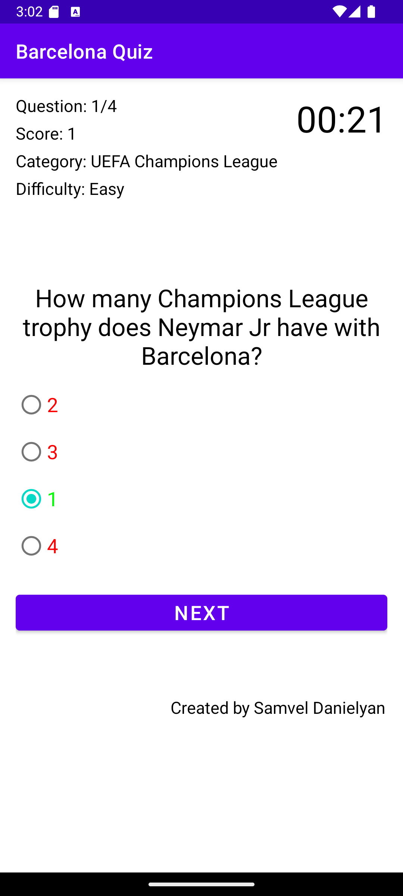
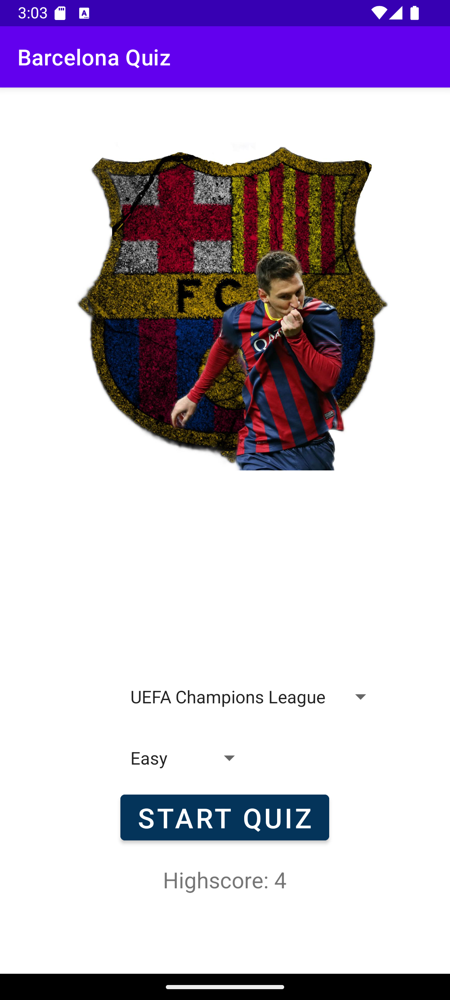

# Barcelona Quiz 🏆

Barcelona Quiz is a simple Android quiz application about FC Barcelona, built as a beginner Android project in 2022.

This project demonstrates:
- Basic Android UI
- Activities and navigation
- SQLite database usage
- Simple business logic
- Unit testing
- Clean project structure
---

## 📱 Features

- Multiple quiz categories:
    - UEFA Champions League
    - La Liga
    - Spanish Cup
    - History
    - Stadium
    - Records
- Timed questions
- Score tracking
- Result screen
- Local question storage (SQLite)

---

## 🛠 Tech Stack

- **Language:** Java
- **IDE:** Android Studio
- **UI:** XML Layouts
- **Database:** SQLite
- **Build Tool:** Gradle
- **Testing:** JUnit

---

## 🧪 Tests

The project contains unit tests for:

- Category ID ↔ Name mapping
- QuestionModel getters/setters
- Quiz scoring logic

## 🚀 How to Run

1. Clone the repository:
   ```bash
   git clone https://github.com/SamvelDanielian/barcelona-quiz.git
2. Open in Android Studio
3. Let Gradle sync
4. Run on emulator or device
2. Let Gradle sync

```md
## 📸 Screenshots

### Home


### Quiz


### Results

```

## 👤 Author
## Sam

Junior QA Automation Engineer  
Learning Android Development with Java

- Experience in manual and automation testing
- Working with Java, Selenium, Gradle, and Android Studio
- This project represents my first steps in Android application development